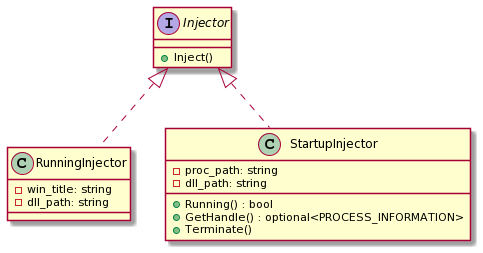

# Windows Dynamic-link Library Injector


[](https://www.microsoft.com/en-ie/windows)
[](https://www.gnu.org/licenses/gpl-3.0.html)
[](https://zenodo.org/badge/latestdoi/302512489)

## Languages

- [English](https://github.com/Zhuagenborn/Dll-Injector/blob/main/README.md)
- [简体中文](https://github.com/Zhuagenborn/Dll-Injector/blob/main/README-CN.md)

## Introduction

***Dll-Injector*** is a **Windows dynamic-link library** injection tool written in *C++20*. It can inject a `.dll` file into a running process by searching its window title or create a new process with an injection.

## Getting Started

**Warning**

> The project does not contain building configuration files, the source code can be built manually with *Visual Studio 2022*.

### Prerequisites

The project need to configure on/for **Windows 32-bit**.

## Usage

```console
Dll-Injector [-f <proc-path> | <win-title>] <dll-path>
```

**Inject a Dll into a Running Process**

To inject a `.dll` file into a running process, you need to specify the *window title* of the target process and the *path* of the `.dll` file. If `dll-path` is a relative path, it must be relative to the `Dll-Injector.exe`.

```console
Dll-Injector <win-title> <dll-path>
```

For example, inject the `dllmain_msg.dll` (assume it is in the same directory as *Dll-Injector*) into *Windows Calculator*:

```console
Dll-Injector Calculator dllmain_msg.dll
```

**Create a New Process with an Injection**

To create a new process with an injection, you must enable the `-f` option firstly and then specify the *paths* of the target process and the `.dll` file. If `dll-path` is a relative path, it must be relative to the process file.

```console
Dll-Injector -f <proc-path> <dll-path>
```

## Documents

Code comments follow [*Doxygen*](https://www.doxygen.nl) specification.

The class diagram is created by [*PlantUML*](https://plantuml.com). See `docs/class-diagram.plantuml` for more details.



## License

Distributed under the *GNU General Public License*. See `LICENSE` for more information.

## Citing

```tex
@software{chenzs108_2021_4698332,
  author       = {Chen Zhenshuo and Liu Guowen},
  title        = {Zhuagenborn/Dll-Injector: v1.0.0},
  month        = apr,
  year         = 2021,
  publisher    = {Zenodo},
  version      = {v1.0.0},
  doi          = {10.5281/zenodo.4698332},
  url          = {https://doi.org/10.5281/zenodo.4698332}
}
```

## Contact

- ***Chen Zhenshuo***

  > ***GitHub***: https://github.com/czs108
  >
  > ***E-Mail***: chenzs108@outlook.com
  >
  > ***WeChat***: chenzs108

- ***Liu Guowen***

  > ***GitHub***: https://github.com/lgw1995
  >
  > ***E-Mail***: liu.guowen@outlook.com